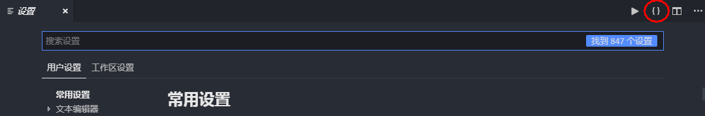
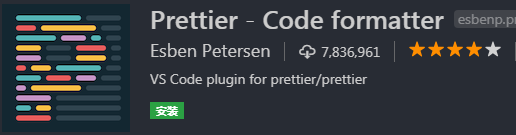
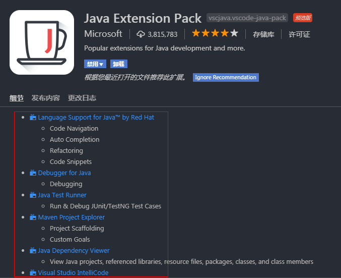
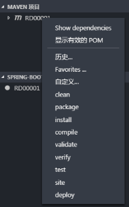

# Visual Studio Code


* 免费开源

* 现代化轻量级，占用内存低

* 支持插件扩展

* 集成GIT

* 内置对JavaScript、TypeScript、Node.js语言的支持

* 支持几乎所有主流的开发语言（C++，C#，Python，PHP等）

* 跨平台支持Windows、Mac以及Linux

* 支持国内网络

&emsp;&emsp;作为微软的良心之作，VSCode体现了世界一流软件公司的开放和情怀，随着VSC的插件越发成熟，它不再只是一款前端神器，而是适合各种开发语言的IDE。个人认为，虽然在单一语言上它还无法与专业软件比较（如Java的eclipse和idel等），但对于多语言开发者，使用VSC的工作效率将高于多个IDE的来回切换，也激发了学习新语言的兴趣。以下是对目前个人所需开发环境的搭建说明。

---

## 一、下载安装
&emsp;&emsp;[VSC官网](https://code.visualstudio.com/)国内可直连，这里提供1.33版Win64位用户级安装包：VSCodeUserSetup-x64-1.33.1.exe

## 二、界面初识
&emsp;&emsp;（以下图为中文界面）

&emsp;&emsp;左侧工具栏从上而下依次为资源管理器、搜索、源代码管理、调试、扩展、（测试）

* 资源管理器：选择需要打开的文件/文件夹/项目（图中MAVEN等为插件扩展分类）。单击文件会临时打开文件，双击则固定在列表中。VSC只支持打开单一文件夹，如果需要同时打开多个项目，请放在同一根目录下（文件太多会影响启动效率）。


* 搜索：对所有在资源管理器中的文件进行搜索，支持正则

* 源代码管理：自动识别目录下代码管理文件（如.git、.svn），包含所有常用操作


* 调试：根据不同文件/项目，将自动配置（手动修改）调试器，图为SpringBoot启动器


* 扩展：管理、下载插件处，后面详细说明常用插件


* 设置：右键齿轮形按钮，点击设置，打开后点击{}按钮，进入json格式，便于后续配置。

&emsp;&emsp;比如代理配置，需添加以下两行：
```
"http.proxy": "proxysz.aac.com:80",

"http.proxyStrictSSL": false
```




## 三、语言切换
&emsp;&emsp;VSC默认语言为英文，如果不熟悉该IDE，建议先使用中文版。

1.点击进入插件管理，搜索chinese，找到Chinese (Simplified) Language Pack for Visual Studio Code，点击安装

2.使用快捷键组合【Ctrl+Shift+p】或【F1】，在搜索框中输入“configure display language”

3.修改locale.json文件下的属性“locale”为“zh-CN”

4.重启VSC

## 四、常用插件
&emsp;&emsp;VSC插件十分丰富，且同类型插件也很多，比如几乎每个开发者都要使用到的代码格式化工具，以下是使用人数最多的两款，相关使用配置请百度谷歌。




以下是几套常用环境搭建说明：

1.Java：搭建Java开发环境，首先请安装JDK并配置JAVA_HOME，安装Java Extension Pack插件即可，该插件会自动安装图中相关插件，安装成功后进入设置-json格式，添加以下行重启即可：
```
"java.home": "C:\\Program Files\\Java\\（JDK目录）"
```
（记得添加逗号保证JSON格式正确）



2.Maven：安装Maven for Java插件，Maven使用需要有JDK支持，使用Maven自身的settings文件，配置后在资源管理器下会有MAVEN项目分类，可右键执行相关操作：
```
"java.configuration.maven.userSettings": "（MAVEN目录）\\conf\\settings.xml",
"maven.executable.path": "（MAVEN目录）\\bin\\mvn.cmd",
"maven.terminal.useJavaHome": true,
"maven.terminal.customEnv": [
    {
        "environmentVariable": "JAVA_HOME",
        "value": "C:\\Program Files\\Java\\（JDK目录）"
    }
]
```


3.Python：安装Python插件，本人安装的py3，不清楚py2是否一样：
```
"python.pythonPath": "（Python目录）"
```

4.Node.js：VSC原生支持，仅需配置Node.js环境变量（支持cmd执行"node xxx.js"即可）

（很多提示以及前端调试都在帮助-切换开发人员工具 中，类似Chorme的F12）

&emsp;&emsp;在此再推荐几款插件：
* Code Runner：支持多种开发语言
* Eclipse Keymap：修改使用eclipse的快捷键
* jQuery Code Snippets：支持jQ代码补齐
* JS-CSS-HTML Formatter：配置简单的前端代码格式化
* open in browser：快速打开页面文件
* Setting Sync：将插件、配置文件同步至Github
* Spring Boot Extension Pack：SpringBoot开发包
* Tomcat for Java：仅支持war包，原理等同于将war包cp至webapps目录，故无法调试

&emsp;&emsp;此外还有许多有趣的插件请自行搜索试用。